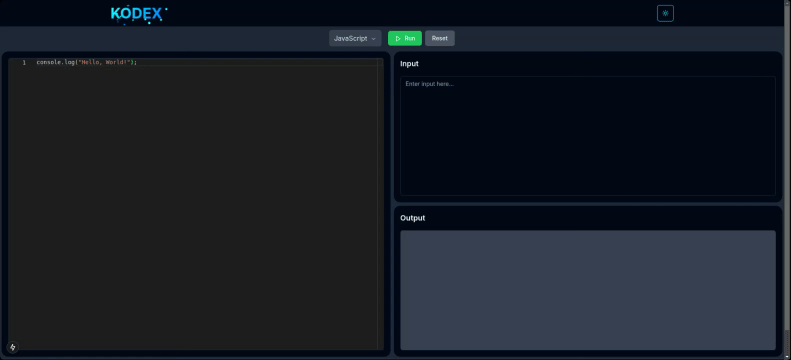

# Kodex Server

The **Kodex Server** is the backend service for the Kodex platform, handling code execution, API requests, and database interactions. Built with **Express.js**, **Docker**, and **Prisma**, it supports dynamic, multi-language code execution environments and integrates seamlessly with the [Kodex frontend](https://github.com/ViragJain3010/Kodex-Frontend).

## Demo

Check out the demonstration of the **Kodex Server** in action:



## Table of Contents

- [Requirements](#requirements)
- [Setup](#setup)
- [Directory Structure](#directory-structure)
- [Running the Server](#running-the-server)
- [API Endpoints](#api-endpoints)
- [Docker Configuration](#docker-configuration)
- [Middleware](#middleware)
- [Adding new Language Support](#adding-new-language-support)

## Requirements

- **Node.js** (version 14 or higher)
- **Docker** (with dynamic container management support)
- **Docker Compose**

## Setup

1. **Clone the Repository:**

   ```bash
   git clone https://github.com/ViragJain3010/Kodex-Server
   cd kodex/server
   ```

2. **Install Dependencies:**

   ```bash
   npm install
   ```

3. **Configure the Environment:**

   - Create a `.env` file in the `kodex/server` directory based on the provided `.env.example` template.
   - Configure environment variables for database connection, Docker settings, and other server options.

4. **Build and Run Docker Containers:**

   ```bash
   docker compose build
   docker compose up   # For testing, if ran successfully then execute `docker compose down`
   ```

   > **Tip:** If you encounter errors,try restarting the terminal and rerun the commands.

## Directory Structure

- **`api/`**: Express routes for handling API requests.
- **`config/`**: Configuration files for server setup and environment variables.
- **`docker/`**: Dockerfile and related configuration files for dynamic code execution.
- **`executors/`**: Code execution logic for supported programming languages.
- **`middleware/`**: Custom Express middleware functions.
- **`prisma/`**: Prisma ORM schema and client configuration.
- **`standalone/`**: Standalone Next.js build for the frontend (used in production).
- **`utils/`**: Utility functions and helper classes.

## Running the Server

- **Development Mode:**

   ```bash
   npm run dev
   ```

   Uses the frontend build in the `standalone` folder for testing.

- **Production Mode:**

   ```bash
   npm start
   ```

   Starts the backend server at `localhost:3001`. The frontend needs to be started separately in another terminal, after which it can communicate with the backend via API requests.

## API Endpoints

### **Code Execution**

- **`POST /api/execute`**  
  Executes code in the specified programming language.  
  **Request Body**:

  ```json
  {
    "language": "python",
    "code": "print('Hello, World!')",
    "input": ""
  }
  ```

### **Supported Languages**

- **`GET /api/languages`** Retrieves a list of supported programming languages.

- **`Get /api/languages/{language}`** Retrieves the configuration of a specific language.

### **Testing Endpoint**

- **`POST /api/test`**
  A utility endpoint for server testing (development purposes only).

## Docker Configuration

Docker dynamically creates and manages containers for secure, isolated code execution.

**Key Configuration:**
- `docker-compose.yml`: Defines services and networks for the backend and execution environments.
- **Docker Services:**
  - `javascript-runner`: Runs JavaScript code.
  - `python-runner`: Runs Python code.
  - `cpp-runner`: Runs C++ code.
- **Docker Networks:**
  - `code-network`: A bridge network for communication between containers.
    > **Note:** Ensure this network is created to avoid errors.
  - **To Create the Docker Network**
      Run the following command:
      ```bash
      docker network create code-network
      ```
      `code-network` is the name of the network used in your docker-compose.yml file. You can replace it with any other name, but ensure consistency in your configuration.

<!-- ## Prisma Setup

Prisma is used for seamless database interactions.

- **Schema Location:** `prisma/schema.prisma`
- **Client Configuration:** Generated in `node_modules/.prisma/client`.
- **Database Connection:** Defined in the `.env` file.

**Common Commands:**
```bash
# Generate Prisma client
npx prisma generate

# Apply database migrations
npx prisma migrate dev
``` -->

## Middleware

Custom middleware functions are implemented in the `middleware/` directory.

<!-- - **Authentication Middleware:** Configured in `middleware/authMiddleware.js`.
  - Ensures requests are authorized where required. -->

## **Adding new Language Support**

The language setup is divided into three parts:  
1. **Docker Setup**  
2. **Language Configuration**  
3. **Executor Class Setup**

Follow the steps below to integrate a new programming language into the system:

---

### **1. Docker Setup**  
1. Inside the **[docker](/docker)** directory, create a new folder for your language.  
2. Add a `Dockerfile` to this folder to define the environment for code execution.  
   - Ensure the Dockerfile has all the necessary tools and configurations for the language.
   - Please see the [base Dockerfile](/docker/base/Dockerfile) for example.
3. Update the **[docker-compose.yml](/docker-compose.yml)** file:  
   - Add a service configuration for the new language.  
   - Verify the paths for `context`, `dockerfile`, `volumes`, and `working_dir` are correct.  


### **2. Language Configuration**  
Add the language details to the **[Languages.config.js](/config/Languages.config.js)** file. Use the following structure:

```js
languages = {
  key: { // Unique identifier for the language
    name: "Language Name", // Display name for the dropdown
    extension: ".ext", // File extension for the language

    docker: {
      image: "docker-image-name", // Docker image name
      workDir: "/app", // Container working directory
      timeout: 10000, // Max runtime in ms
      memory: "128mb", // Memory allocation
      cpus: "0.5", // CPU allocation
    },

    execution: {
      command: "command", // Command to execute the code
      compileCommand: "compile command", // Compilation command, if required
      filePrefix: "file", // Prefix for generated code files
      defaultBoilerplate: "code", // Default code template
    },

    settings: {
      supportsInput: boolean, // Whether the language supports standard input
      supportsFiles: boolean, // Whether file handling is supported
      requiresCompilation: boolean, // Whether compilation is required
    },
  },
};
```

> **Note:** Ensure all fields are correctly filled to prevent unexpected errors.


### **3. Executor Class Setup**  

1. Create a new executor class for the language inside the **[executors](/executors)** directory.  
2. Follow the structure of the existing executor classes to implement the logic for:  
   - Code execution  
   - Handling pre- and post-execution tasks  
   - Managing inputs and outputs  

### **4. Build and Test**  

After completing the above steps:  

1. **Build the Docker images** using the following command: 

   ```sh
   docker compose build
   ```  

2. **Test the setup** by running:  
   ```sh
   docker compose up
   ```  
   - If the containers run successfully, stop them using:  
     ```sh
     docker compose down
     ```  

> ### Why So Much Work for Adding a Single Language?
> This structure ensures safety and high customization for pre- and post-code execution. It makes the system highly robust against misuse and allows complete customization of the execution environment as needed.